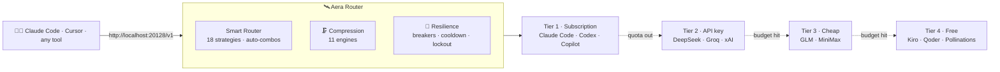
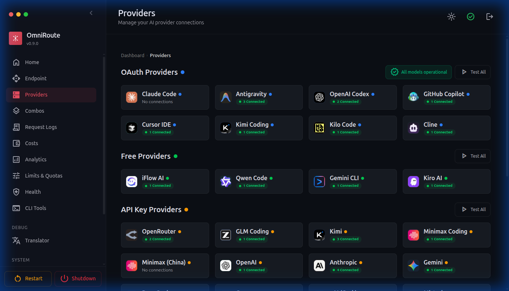
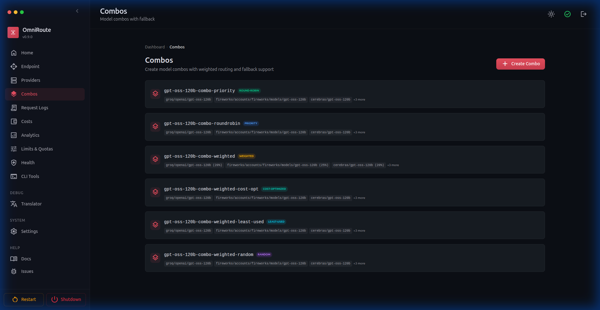
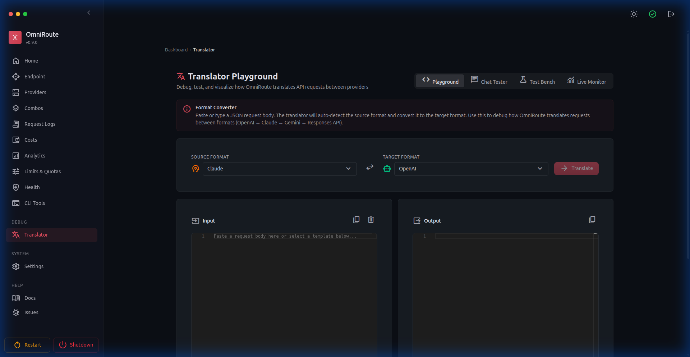
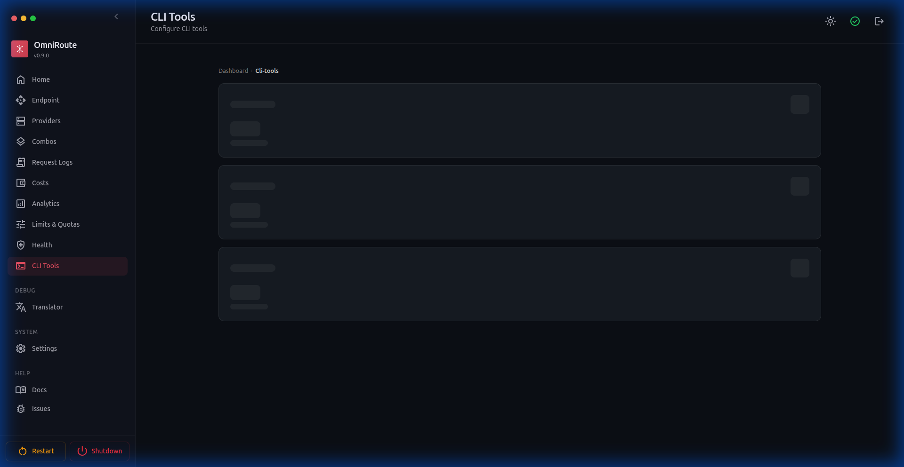
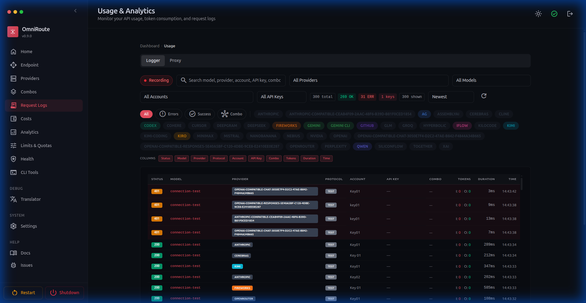

<div align="center">



# Aera Router

### The Free AI Gateway — every AI tool · every provider · one local endpoint

Never hit a rate limit again. Route Claude Code, Codex, Cursor, Cline & 30+ tools
through **one endpoint** into **271 providers (90+ free)**, with automatic fallback
and stacked token compression that saves **15–95%** of tokens.

<p>
  <a href="mailto:info@manoj-dahal.com.np"></a>
  <a href="LICENSE"></a>
  <a href="https://github.com/manoj-dahal/Aera-router"></a>
</p>
<p>
  <a href="https://github.com/manoj-dahal/Aera-router/stargazers"></a>
  <a href="https://github.com/manoj-dahal/Aera-router/network/members"></a>
  <a href="https://github.com/manoj-dahal/Aera-router/issues"></a>
  <a href="https://github.com/manoj-dahal/Aera-router/commits/main"></a>
  
  
</p>

[**⚡ Quick Start**](#-quick-start) ·
[**🎯 Combos**](#-combos--never-stop-coding) ·
[**🌐 Providers**](#-271-providers--90-free) ·
[**🗜️ Compression**](#%EF%B8%8F-compression--use-fewer-tokens) ·
[**🔌 CLI · MCP · A2A**](#-cli--mcp--a2a) ·
[**📖 Docs**](#-documentation) ·
[**📸 Screenshots**](#-screenshots)

</div>

---

## ⚡ What is Aera Router?

Aera Router is a **local AI gateway** that sits between your coding tools and every
AI provider you use. One endpoint — `http://localhost:20128/v1` — speaks
**OpenAI, Anthropic, Gemini and Responses API**, and routes each request to the best
available model across your subscriptions, API keys and free tiers.



- **🚫 Never hit limits** — auto-fallback across 271 providers in milliseconds
- **💰 $0 to start** — 90+ free tiers, 40+ free forever, ~1.4B free tokens/month
- **🗜️ 15–95% token savings** — stacked RTK + Caveman compression, ~89% avg on tool-heavy sessions
- **🧩 Every tool works** — 30+ coding agents, one config
- **🔒 Private** — local-first, AES-256-GCM encrypted keys, zero telemetry

---

## ✨ Highlights

| | |
|---|---|
| 🎯 **Combos (flagship)** | Chains of models Aera Router falls back across automatically — quota out, provider down, cost spike → the next model answers. |
| 🤖 **Zero-config `auto`** | Set model to `auto` / `auto/coding` / `auto/fast` / `auto/cheap` and a 12-factor live scorer picks the best connection. |
| 🔀 **18 routing strategies** | priority, weighted, round-robin, cost-optimized, headroom, lkgp, fusion, pipeline & more — mix per combo step. |
| ⚖️ **Quota-Share** | Split one subscription fairly across a team of keys — weighted slices, burst mode, per-model caps. |
| 🧱 **3-layer resilience** | Provider circuit breakers → per-key cooldown → per-model lockout. Terminal states surfaced, never silent. |
| 🧰 **104 MCP tools + A2A** | Agents can drive the whole gateway over MCP (stdio/HTTP/SSE) or A2A (JSON-RPC 2.0). |
| 🧠 **Memory & guardrails** | Opt-in FTS5 + vector memory, PII redaction, prompt-injection guard on every route. |
| 🖥️ **Runs anywhere** | Node server · Electron desktop · Android Termux · PWA — 100% TypeScript, local SQLite. |

---

## 🚀 Quick Start

**1 · Install & run from source**

```bash
git clone https://github.com/manoj-dahal/Aera-router.git
cd Aera-router
cp .env.example .env
npm install
PORT=20128 npm run dev
```

> Dashboard → `http://localhost:20128` · API → `http://localhost:20128/v1`

**2 · Connect a free provider** (no signup needed)

Dashboard → **Providers** → connect **Kiro AI** (free Claude) or **OpenCode Free** (no auth) → done.

**3 · Point your coding tool at it**

```txt
Base URL : http://localhost:20128/v1
API Key  : [copy from Dashboard → Endpoints]
Model    : auto        ← zero-config smart routing (or any provider/model)
```

Or let the CLI do it — `aera-router setup-*` writes configs for 12+ coding tools;
`aera-router launch` / `launch-codex` are fully zero-config.

**4 · Verify**

```bash
curl http://localhost:20128/v1/models -H "Authorization: Bearer YOUR_KEY"
```

Your connected models are listed — start coding. 🎉

<details>
<summary><b>📦 More ways to run — Docker · Electron · Termux · Nix</b></summary>

**🐳 Docker (build locally)**

```bash
docker build -t aera-router .
docker run -d --name aera-router --restart unless-stopped --stop-timeout 40 \
  -p 20128:20128 -v aera-router-data:/app/data aera-router:latest
```

📖 [Docker Guide](docs/guides/DOCKER_GUIDE.md) — Compose profiles, Caddy HTTPS, Cloudflare tunnels · [Podman](contrib/podman/README.md)

**🖥️ Desktop (Electron)** — Windows / macOS / Linux, native window + system tray

```bash
npm run electron:build
```

**📱 Android (Termux)** — runs on your phone, 24/7, no root

```bash
pkg install nodejs git
git clone https://github.com/manoj-dahal/Aera-router.git && cd Aera-router
npm install && npm run dev
```

**🔧 Nix / devbox**

```bash
nix develop && npm run dev        # or: devbox run npm run dev
```

> 💡 If a client can't send `Authorization` headers, use the tokenized aliases:
> `http://localhost:20128/vscode/YOUR_KEY/chat/completions` (and `/models`,
> `/responses`, Ollama-style `/api/chat`, `/api/tags`). Header auth stays the preferred mode.

</details>

---

## 🎯 Combos — Never stop coding

A **combo** is a chain of models Aera Router routes across **automatically**. Quota
runs out, a provider fails, costs spike — the combo silently slides to the next model.
**This is what makes Aera Router unbreakable.** 🛡️

**⚡ Zero-config — just use `auto`**

| Model ID | What it optimizes for |
|---|---|
| `auto` | 🎯 Balanced default (sticks to your last good provider) |
| `auto/coding` | 🧑‍💻 Quality-first weights for code generation |
| `auto/fast` | ⚡ Lowest latency first |
| `auto/cheap` | 💰 Cheapest per token first |
| `auto/offline` | 🔋 Most quota / rate-limit headroom first |
| `auto/smart` | 🔭 Quality-first + 10% exploration to discover better models |

<details>
<summary><b>🔀 All 18 routing strategies</b></summary>

| # | Strategy | What it does |
|---|---|---|
| 1 | `priority` | First-target ordered list — drain each before the next 🥇 |
| 2 | `fill-first` | Fill each target's quota fully before moving on |
| 3 | `weighted` | Weighted random by per-target weight |
| 4 | `round-robin` | Cycle through targets in order |
| 5 | `p2c` | Power-of-two-choices load balancing |
| 6 | `least-used` | Pick the target with the lowest current load |
| 7 | `random` | Uniform random pick (deduplicated) |
| 8 | `strict-random` | Random, repeats allowed 🎲 |
| 9 | `cost-optimized` | Minimize $ per request from live catalog pricing 💸 |
| 10 | `headroom` | Most remaining quota wins |
| 11 | `reset-window` | Prefer the target whose quota resets soonest |
| 12 | `reset-aware` | Rank by quota reset time, short windows first 📊 |
| 13 | `context-relay` | Hand off context across targets in long conversations 🧠 |
| 14 | `context-optimized` | Best fit for the current context size |
| 15 | `lkgp` | Last-Known-Good Path — sticky to the last success |
| 16 | `auto` | 12-factor live scoring across every connection 🤖 |
| 17 | `fusion` | Fan out to a panel of models + judge synthesizes one answer 🧬 |
| 18 | `pipeline` | Chain steps — each target's output feeds the next 🔗 |

📖 [Auto-Combo Engine](docs/routing/AUTO-COMBO.md) · [Resilience Guide](docs/architecture/RESILIENCE_GUIDE.md)

</details>

**⚖️ Quota-Share** — one Codex Pro plan / GLM seat shared by a team? Quota-Share splits a
provider's time-based quota **fairly** across the keys in a pool (weights like `50/30/20`,
`hard` / `soft` / `burst` policy, per-(key, model) caps), work-conserving so idle slices
are lent out. 📖 [Quota Sharing Engine](docs/routing/QUOTA_SHARE.md)

---

## 🗜️ Compression — use fewer tokens

Every request passes through a stack of **11 composable engines** (Session-Dedup, CCR,
RTK, Headroom, Relevance, Caveman, LLMLingua-2, Lite, Aggressive, Ultra…) — transparently,
with **code, URLs and JSON always preserved byte-perfect**.

| Preset | Savings | Best for |
|---|---|---|
| 🪶 **Lite** | ~15% | Always-on safe default |
| 🪨 **Standard** | ~30% | Daily coding |
| ⚡ **Aggressive** | ~50% | Long tool-heavy sessions |
| 🔥 **Ultra** | ~75% | Maximum savings |
| 🧰 **RTK** | 60–90% | Shell/test/build/git output |
| 🔗 **Stacked (RTK → Caveman)** | **78–95%** | Mixed prompts + tool logs |

> **Before (69 tokens):** *"The reason your React component is re-rendering is likely because you're creating a new object reference on each render cycle. When you pass an inline object as a prop…"*
>
> **After (19 tokens):** *"New object ref each render. Inline object prop = new ref = re-render. Wrap in useMemo."* — **Same answer. 72% fewer tokens. Zero accuracy loss.** ✅

📖 [Compression Guide](docs/compression/COMPRESSION_GUIDE.md) · [Engines](docs/compression/COMPRESSION_ENGINES.md) · [RTK](docs/compression/RTK_COMPRESSION.md)

---

## 🌐 271 providers · 90+ free

The most complete catalog of any open-source router — **271 providers**, **90+ with a
free tier**, **40+ free forever**. Every major lab through one endpoint:

`OpenAI` · `Anthropic` · `Gemini` · `xAI` · `DeepSeek` · `Mistral` · `Qwen` · `Meta` ·
`Groq` · `NVIDIA` · `MiniMax` · `Cohere` · `Perplexity` · `HuggingFace` · `Together` ·
`Fireworks` · `Cloudflare` · `Baidu` · **+220 more**

**🆓 Free forever — $0, no card:** AgentRouter ($100 credits) · Qoder AI (unlimited) ·
Pollinations (no key) · Cloudflare AI (10K neurons/day) · NVIDIA NIM (~40 RPM) ·
Cerebras (1M tokens/day) · LongCat … plus **~1.4B free tokens/month** across the
documented free tiers of 39 provider pools / 460+ models — tracked live on
`/dashboard/free-tiers`.

📖 [Provider Reference](docs/reference/PROVIDER_REFERENCE.md) · [Free Tiers methodology](docs/reference/FREE_TIERS.md)

---

## 🤖 Works with your tools

One config — `http://localhost:20128/v1` — and **every** OpenAI-compatible AI IDE or CLI
runs on free & low-cost models:

**Claude Code** · **Codex CLI** · **Cline** · Kilo Code · Roo Code · Continue · Aider ·
ForgeCode · DeepSeek TUI · OpenCode · Factory Droid · Copilot CLI · Cursor CLI · jcode ·
CodeWhale · Smelt · Pi · Grok Build · Hermes Agent · OpenClaw · Goose · Open Interpreter ·
Warp AI · Agent Deck · Kiro · Command Code · Antigravity · Windsurf · AMP

📖 Per-tool setup for all 33 tools → [docs/reference/CLI-TOOLS.md](docs/reference/CLI-TOOLS.md) ·
🧩 OpenCode plugin → [docs/frameworks/OPENCODE.md](docs/frameworks/OPENCODE.md)

---

## 🔌 CLI · MCP · A2A

Aera Router is a **full command-line cockpit** — 80+ commands:

```bash
aera-router          # serve gateway + dashboard (port 20128)
aera-router chat     # interactive TUI chat (/model /combo /skill /memory)
aera-router setup    # guided first-run wizard
aera-router doctor   # diagnose providers, ports, native deps
```

Drive a **remote** server (VPS) from your laptop with scoped tokens:
`aera-router connect` → `tokens create --scope read` → `contexts use`.

Expose the gateway itself to agents:

| Protocol | Endpoint | Use it for |
|---|---|---|
| 🧰 **MCP (stdio)** | `aera-router --mcp` | Claude Desktop, Cursor, any MCP client |
| 🌊 **MCP (HTTP)** | `http://localhost:20128/api/mcp/stream` | **104 tools**, 31 scopes, full audit |
| 📡 **MCP (SSE)** | `http://localhost:20128/api/mcp/sse` | Streaming MCP transport |
| 🤝 **A2A** | `http://localhost:20128/.well-known/agent.json` | Agent-to-agent, JSON-RPC 2.0 + SSE |

```bash
# Give Claude Code the full Aera Router toolset over MCP:
claude mcp add-server aera-router --type http --url http://localhost:20128/api/mcp/stream
```

📖 [MCP Server](docs/frameworks/MCP-SERVER.md) · [A2A Server](docs/frameworks/A2A-SERVER.md) · [Remote Mode](docs/guides/REMOTE-MODE.md)

---

## 🔒 Private & local-first

- 🏠 Runs **100% on your hardware** — zero cloud hops, zero telemetry by default
- 🔐 Credentials encrypted at rest (**AES-256-GCM**); no account, no sign-up
- 🛡️ Hardened gateway: API-key scoping, IP filtering, rate limits, prompt-injection guard
- 🧼 Upstream header scrubbing · sanitized errors · loopback-only process routes
- 🧾 Local audit trail in your own SQLite · **MIT-licensed**, fully open source

📖 [Authorization](docs/architecture/AUTHZ_GUIDE.md) · [Guardrails](docs/security/GUARDRAILS.md) · [Compliance](docs/security/COMPLIANCE.md)

---

## 🏗️ How it works



Every response carries cost/usage telemetry in `X-Aera-Router-*` headers. 💸

---

## 🏆 What sets Aera Router apart

| Feature | Aera Router | Other routers |
|---|---|---|
| 🌐 Providers | **271** | 20–100 |
| 🆓 Free providers | **90+ (40+ free forever)** | 1–5 |
| 🔀 Routing strategies | **18** | 1–3 |
| 🗜️ Token compression | **RTK + Caveman stacked (15–95%)** | None / 20–40% |
| 🧰 Built-in MCP server | **104 tools, 3 transports, 31 scopes** | Rare |
| 🤝 A2A agent protocol | **6 skills, JSON-RPC 2.0** | None |
| 🧠 Memory (FTS5 + vector) | **Yes** | Rare |
| 🛡️ Guardrails (PII, injection, vision) | **Yes** | Rare |
| 🖥️ Multi-platform | **Web · Desktop · Termux · PWA** | Web only |
| 🌍 i18n | **43 locales** | 0–4 |

📊 Detailed comparison vs LiteLLM, OpenRouter & Portkey → [docs/comparison](docs/comparison/AERA_ROUTER_VS_ALTERNATIVES.md)

---

## 📸 Screenshots

<details>
<summary><b>Open the dashboard gallery (8 pages)</b></summary>

| Page | Screenshot | Page | Screenshot |
|---|---|---|---|
| Providers |  | Combos |  |
| Analytics |  | Health |  |
| Translator |  | Settings |  |
| CLI Tools |  | Usage Logs |  |

</details>

---

## 📖 Documentation

| 🚀 Getting started | 🔧 Operations | 🧠 Features |
|---|---|---|
| [User Guide](docs/guides/USER_GUIDE.md) | [Docker Guide](docs/guides/DOCKER_GUIDE.md) | [Auto-Combo](docs/routing/AUTO-COMBO.md) |
| [Setup Guide](docs/guides/SETUP_GUIDE.md) | [VM Deployment](docs/ops/VM_DEPLOYMENT_GUIDE.md) | [Quota-Share](docs/routing/QUOTA_SHARE.md) |
| [CLI Tools](docs/reference/CLI-TOOLS.md) | [Fly.io](docs/ops/FLY_IO_DEPLOYMENT_GUIDE.md) | [Compression](docs/compression/COMPRESSION_GUIDE.md) |
| [Remote Mode](docs/guides/REMOTE-MODE.md) | [Termux](docs/guides/TERMUX_GUIDE.md) | [Memory](docs/frameworks/MEMORY.md) |
| [Claude Code Config](docs/guides/CLAUDE-CODE-CONFIGURATION.md) | [PWA](docs/guides/PWA_GUIDE.md) | [MCP Server](docs/frameworks/MCP-SERVER.md) |
| [Quick Start](#-quick-start) | [Environment](docs/reference/ENVIRONMENT.md) | [API Reference](docs/reference/API_REFERENCE.md) |

🌍 Translated into **43 languages** → [`docs/i18n/`](docs/i18n/)

---

## 🛠️ Tech stack

**Node.js 22/24 LTS** · **TypeScript 6** (100%) · **Next.js 16 + React 19 + Tailwind 4** ·
SQLite (`better-sqlite3`, fallback `node:sqlite` / sql.js WASM) · Zod · SSE + WebSocket ·
OAuth 2.0 (PKCE) + JWT + API keys · MCP + A2A v0.3 · **25,000+ tests** · Electron · GitHub Actions

---

## 🤝 Contributing

Contributions welcome! See [CONTRIBUTING.md](CONTRIBUTING.md), grab a `good first issue`,
or open a [discussion](https://github.com/manoj-dahal/Aera-router/discussions).
🐛 Bug reports → [issues](https://github.com/manoj-dahal/Aera-router/issues)
(attach `npm run system-info` output).

⭐ **If Aera Router saves you money or a rate-limit headache — star the repo!** ⭐

---

<div align="center">

### ✨ Made by **Manoj Dahal** ✨

📧 [info@manoj-dahal.com.np](mailto:info@manoj-dahal.com.np) ·
🐙 [github.com/manoj-dahal/Aera-router](https://github.com/manoj-dahal/Aera-router)

Released under the **MIT License** — see [LICENSE](LICENSE) and [NOTICE](NOTICE.md).

</div>
